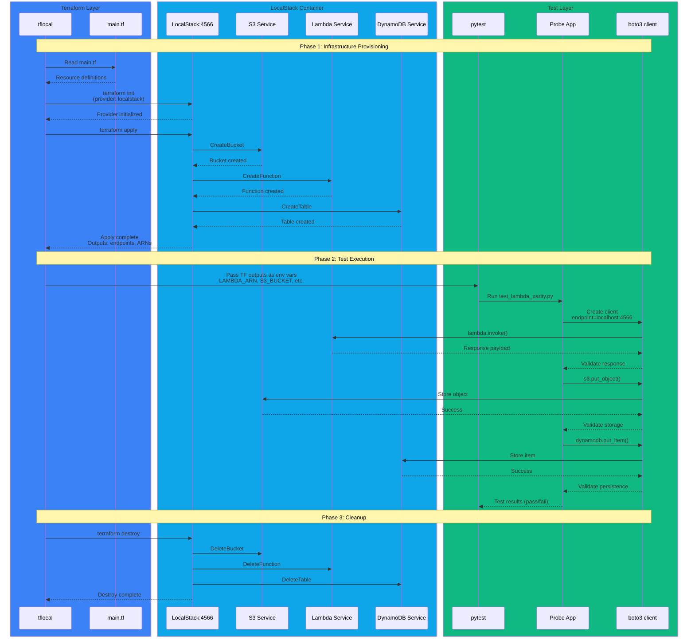

# LocalStack Architecture Validator - System Architecture


## Data Flow


## Component Details

### Mining Phase
| Component | Input | Output | Method |
|-----------|-------|--------|--------|
| GitHub API Scraper | Repo URLs | YAML/HCL files | REST API + file download |
| CloudFormation Parser | CFN templates | Resource definitions | YAML/JSON parsing |
| Terraform Registry API | Module URLs | HCL configurations | Registry API + GitHub |
| Claude Vision | PNG/SVG images | Service list + topology | AI image analysis |

### Processing Phase
| Component | Input | Output |
|-----------|-------|--------|
| Architecture Extractor | Raw configs | Normalized arch definition |
| Service Identifier | Arch definition | AWS service list |
| Terraform Generator | Service list | main.tf, variables.tf, outputs.tf |
| Probe App Generator | Arch + TF | Python pytest applications |

### Validation Phase
| Component | Purpose |
|-----------|---------|
| LocalStack | AWS-compatible local cloud |
| tflocal | Terraform wrapper for LocalStack |
| pytest | Python test framework |

### Storage (CAS)
```
docs/data/
├── index.json              # Run metadata + results index
└── objects/
    ├── arch/{hash}.json    # Architecture definitions
    ├── tf/{hash}.json      # Generated Terraform code
    └── app/{hash}.json     # Generated probe applications
```

### Dashboard Features
- **Overview**: Donut chart, pass rate, service count
- **Test Results**: Expandable cards with status badges
- **Details**: Source info, scraping steps, Terraform, probe apps
- **Service Coverage**: Per-service pass rates
- **Run History**: Previous validation runs

---

## GitHub Actions Workflow

```mermaid
flowchart TB
    subgraph Trigger["🚀 Triggers"]
        CRON["⏰ Weekly Schedule<br/>Mondays 3 AM UTC"]
        PUSH["📤 Push to main<br/>(src/templates/docs)"]
        MANUAL["🔘 Manual Dispatch<br/>(workflow_dispatch)"]
    end

    subgraph Runner["🖥️ GitHub Actions Runner (ubuntu-latest)"]
        subgraph Setup["📦 Setup Steps"]
            CHECKOUT["Checkout repo"]
            PYTHON["Setup Python 3.11"]
            DEPS["Install dependencies<br/>(pip install -e .[dev])"]
            TF["Install Terraform 1.5.0"]
            TFLOCAL["Install tflocal"]
            CACHE["Restore cache"]
        end

        subgraph Docker["🐳 Docker Environment"]
            DOCKERD["Start Docker daemon"]
            LS["LocalStack Container<br/>localstack/localstack:latest<br/>Port 4566"]
        end

        subgraph Pipeline["⚡ Validation Pipeline"]
            RUN["ls-arch-validator run<br/>--parallelism 4"]
        end

        subgraph Artifacts["📁 Artifacts"]
            RESULTS["validation-results<br/>(docs/data/, run_output.json)"]
        end

        subgraph Deploy["🌐 Deployment"]
            GHPAGES["peaceiris/actions-gh-pages<br/>Deploy to gh-pages branch"]
        end
    end

    subgraph Outputs["📊 Outputs"]
        DASHBOARD["GitHub Pages Dashboard"]
        ISSUES["GitHub Issues<br/>(for failures)"]
        SUMMARY["Job Summary<br/>(pass rate, stats)"]
    end

    CRON --> CHECKOUT
    PUSH --> CHECKOUT
    MANUAL --> CHECKOUT

    CHECKOUT --> PYTHON --> DEPS --> TF --> TFLOCAL --> CACHE
    CACHE --> DOCKERD --> LS
    LS --> RUN
    RUN --> RESULTS
    RESULTS --> GHPAGES

    GHPAGES --> DASHBOARD
    RUN --> ISSUES
    RUN --> SUMMARY

    classDef trigger fill:#8b5cf6,stroke:#6d28d9,color:#fff
    classDef setup fill:#3b82f6,stroke:#1d4ed8,color:#fff
    classDef docker fill:#0ea5e9,stroke:#0284c7,color:#fff
    classDef pipeline fill:#f59e0b,stroke:#d97706,color:#fff
    classDef output fill:#10b981,stroke:#059669,color:#fff

    class CRON,PUSH,MANUAL trigger
    class CHECKOUT,PYTHON,DEPS,TF,TFLOCAL,CACHE setup
    class DOCKERD,LS docker
    class RUN pipeline
    class DASHBOARD,ISSUES,SUMMARY output
```



---

## Probe App Generation Detail

```mermaid
flowchart LR
    subgraph Input["📥 Input"]
        ARCH["Architecture Definition<br/>{services: [lambda, s3, dynamodb]}"]
        TF["Generated Terraform<br/>main.tf"]
    end

    subgraph Claude["🤖 Claude API"]
        PROMPT["Prompt Engineering"]
        GEN["Code Generation"]
    end

    subgraph ProbeTypes["🧪 Probe Types"]
        API["api_parity<br/>AWS API compatibility"]
        EDGE["edge_cases<br/>Error handling"]
        INT["integration<br/>Cross-service flows"]
        STRESS["stress<br/>Load testing"]
    end

    subgraph Output["📤 Generated Files"]
        subgraph SrcFiles["src/probes/"]
            SRC1["lambda_parity_probe.py"]
            SRC2["s3_integration_probe.py"]
            SRC3["dynamodb_edge_probe.py"]
        end
        subgraph TestFiles["tests/"]
            TST1["test_lambda_parity.py"]
            TST2["test_s3_integration.py"]
            TST3["test_dynamodb_edge.py"]
        end
        REQ["requirements.txt<br/>boto3, pytest, localstack-client"]
    end

    ARCH --> PROMPT
    TF --> PROMPT
    PROMPT --> GEN

    GEN --> API --> SRC1 --> TST1
    GEN --> EDGE --> SRC3 --> TST3
    GEN --> INT --> SRC2 --> TST2

    SRC1 --> REQ
    SRC2 --> REQ
    SRC3 --> REQ

    classDef input fill:#3b82f6,stroke:#1d4ed8,color:#fff
    classDef claude fill:#8b5cf6,stroke:#6d28d9,color:#fff
    classDef probe fill:#f59e0b,stroke:#d97706,color:#fff
    classDef output fill:#10b981,stroke:#059669,color:#fff

    class ARCH,TF input
    class PROMPT,GEN claude
    class API,EDGE,INT,STRESS probe
    class SRC1,SRC2,SRC3,TST1,TST2,TST3,REQ output
```



---

## Terraform ↔ LocalStack ↔ Pytest Interaction



---

## Parallel Validation Architecture

```mermaid
flowchart TB
    subgraph Orchestrator["🎯 Validation Orchestrator"]
        QUEUE["Architecture Queue<br/>(5 architectures)"]
        POOL["Thread Pool<br/>(parallelism=4)"]
    end

    subgraph Workers["👷 Parallel Workers"]
        subgraph W1["Worker 1"]
            LS1["LocalStack #1<br/>Port 4566"]
            TF1["tflocal"]
            PY1["pytest"]
        end
        subgraph W2["Worker 2"]
            LS2["LocalStack #2<br/>Port 4567"]
            TF2["tflocal"]
            PY2["pytest"]
        end
        subgraph W3["Worker 3"]
            LS3["LocalStack #3<br/>Port 4568"]
            TF3["tflocal"]
            PY3["pytest"]
        end
        subgraph W4["Worker 4"]
            LS4["LocalStack #4<br/>Port 4569"]
            TF4["tflocal"]
            PY4["pytest"]
        end
    end

    subgraph Architectures["📦 Architectures Being Validated"]
        A1["aws-quickstart-vpc-3tier"]
        A2["terraform-aws-lambda-api"]
        A3["serverless-rest-api"]
        A4["aws-diagram-microservices"]
        A5["aws-solutions-serverless-image<br/>(skipped: Rekognition)"]
    end

    subgraph Results["📊 Results Aggregator"]
        COLLECT["Collect Results"]
        CAS["Store in CAS"]
        REPORT["Generate Report"]
    end

    QUEUE --> POOL

    POOL --> W1
    POOL --> W2
    POOL --> W3
    POOL --> W4

    A1 --> W1
    A2 --> W2
    A3 --> W3
    A4 --> W4
    A5 -.->|"Skipped"| COLLECT

    TF1 --> LS1 --> PY1 --> COLLECT
    TF2 --> LS2 --> PY2 --> COLLECT
    TF3 --> LS3 --> PY3 --> COLLECT
    TF4 --> LS4 --> PY4 --> COLLECT

    COLLECT --> CAS --> REPORT

    classDef orchestrator fill:#8b5cf6,stroke:#6d28d9,color:#fff
    classDef worker fill:#3b82f6,stroke:#1d4ed8,color:#fff
    classDef arch fill:#f59e0b,stroke:#d97706,color:#fff
    classDef result fill:#10b981,stroke:#059669,color:#fff
    classDef skipped fill:#ef4444,stroke:#dc2626,color:#fff

    class QUEUE,POOL orchestrator
    class LS1,LS2,LS3,LS4,TF1,TF2,TF3,TF4,PY1,PY2,PY3,PY4 worker
    class A1,A2,A3,A4 arch
    class A5 skipped
    class COLLECT,CAS,REPORT result
```



---

## Test Result States

```mermaid
stateDiagram-v2
    [*] --> Queued: Architecture discovered

    Queued --> Mining: Start processing
    Mining --> ServiceCheck: Extract services

    ServiceCheck --> Skipped: Unsupported service<br/>(e.g., Rekognition)
    ServiceCheck --> TerraformGen: All services supported

    TerraformGen --> ProbeGen: main.tf generated
    ProbeGen --> Provisioning: Probe apps ready

    Provisioning --> ProvisionFailed: tflocal apply failed
    Provisioning --> Testing: Infrastructure ready

    Testing --> Passed: All tests pass ✅
    Testing --> Partial: Some tests fail ⚠️
    Testing --> Failed: Critical failure ❌

    Passed --> Cleanup
    Partial --> Cleanup
    Failed --> Cleanup
    ProvisionFailed --> Cleanup

    Cleanup --> [*]: Results stored

    Skipped --> [*]: Marked as failed<br/>(no TF generated)
```


